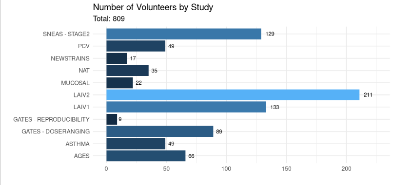
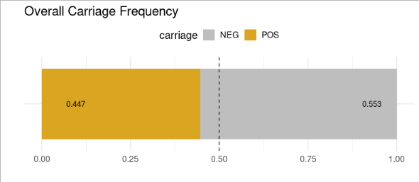
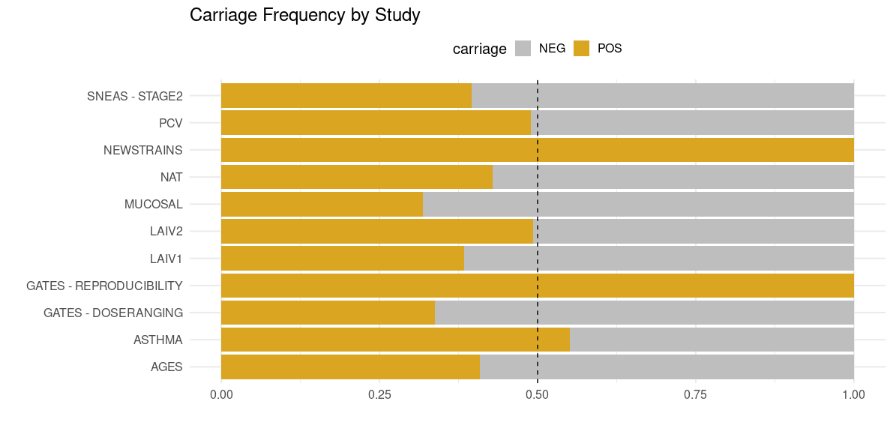
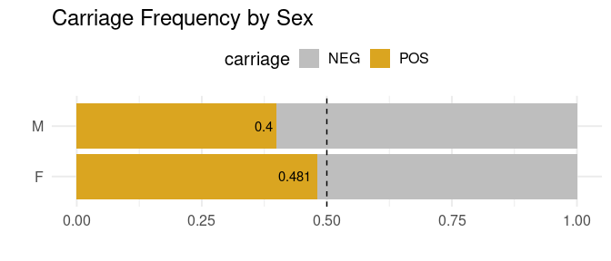
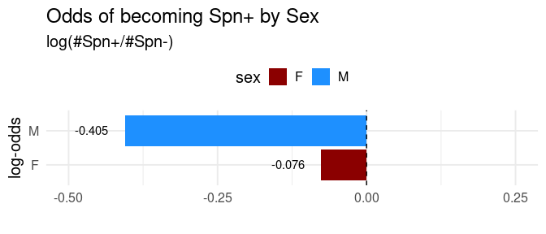
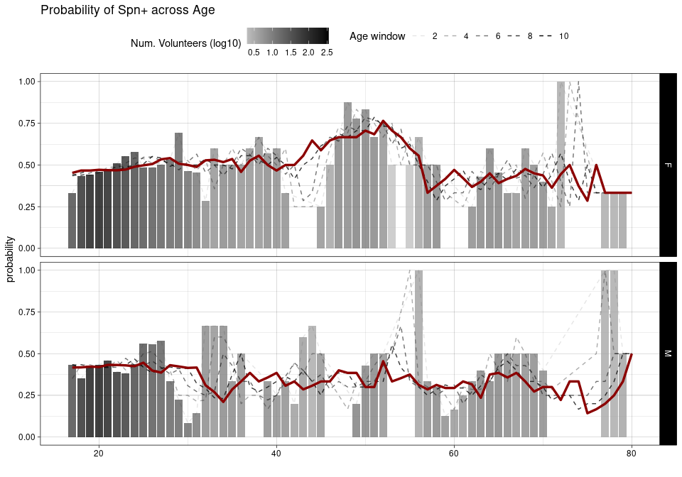

# Data Driven Analysis of Susceptibility to Pneumococcal Carriage

In order to understand the development of Spn carriage it is necessary to know if carriage is some kind of random process. in other words, it is necessary to know if a given subject has the same chance of developing carriage as getting heads in a coin flip after being inoculated by Spn. So, the first question is to know if the probability of developing carriage is different than 0.5.

## Q1: Is developing carriage random?

If carriage development is indeed a random process, a given subject would have a probability of 0.5 of becoming carriage positive (POS), as there are only two possible mutually exclusive outcomes: positive (POS) or negative (NEG).

The null hypothesis is that the probability of developing carriage is equal to not developing carriage, P(POS) = P(NEG). The alternative hypothesis is that the probability of developing carriage is different than the probability of not developing carriage, P(POS) \> P(NEG) or P(POS) \< P(NEG).

To test these hypothesis, we can estimate such probabilities based on the frequency of volunteers that became carriage POS in the whole EHPC consortium. EHPC provides the density of Spn present in the nasal mucosa after its innoculation from a total of 809 subjects that took part in several studies, as showed in the following graph (Fig 2.1).

```{r echo=FALSE, fig.width=50}

```

Based on this data, we arrive at an overall probability equal to 0.447 of developing carriage and a probability \< 0.5 in the majority of the studies, as depicted in the following figures.

```{r echo=FALSE, fig.width=20}

```

```{r echo=FALSE}

```

Across all studies women have a higher probability of developing carriage than men (Fig. 2.4), where men have a clear lower (log) odds ratio than women (Fig. 2.5).

```{r echo=FALSE}

```

```{r echo=FALSE}

```

```{r echo=FALSE}

```
